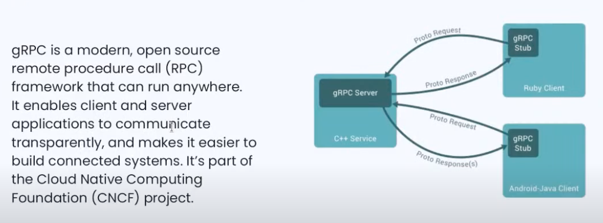
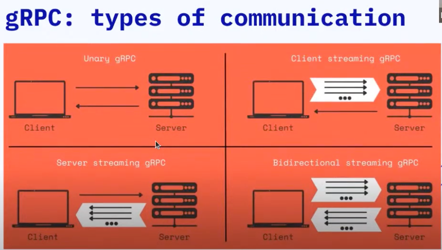

# gRPC Server implementation with Golang

## How gRPC works




## Tools used for

- [Golang](https://go.dev/) Programming language
- [protoc](https://grpc.io/docs/protoc-installation/) Protocol Buffer library
- [grpcui](https://github.com/fullstorydev/grpcui) UI to interact with gRPC server
- [grpcurl](https://github.com/fullstorydev/grpcurl) Client to make gRPC server requests
- [VSCode Golang extension](https://marketplace.visualstudio.com/items?itemName=golang.go)
- [VSCode Proto 3 extension](https://marketplace.visualstudio.com/items?itemName=zxh404.vscode-proto3)

## Protoc Plugins

- [protoc-gen-go](https://pkg.go.dev/github.com/golang/protobuf/protoc-gen-go) protoc-gen-go is a plugin for the Google protocol buffer compiler to generate Go code.
- [protoc-gen-go-grpc](https://pkg.go.dev/google.golang.org/grpc/cmd/protoc-gen-go-grpc) This tool generates Go language bindings of services in protobuf definition files for gRPC.

## Generate Go Code form proto file

```sh
protoc \
--go_out=logger \
--go_opt=paths=source_relative \
--go-grpc_out=logger \
--go-grpc_opt=paths=source_relative \
logger.proto
```

- Generates `logger/logger_grpc.pb.go` with `protoc-gen-go-grpc`
- Generates `logger/logger.pb.go` with `protoc-gen-go`

## Starts the server
```sh
go run main.go
```

## Starts de UI in order to send log messages to the server
```sh
grpcui \
-plaintext \
-use-reflection=false \
-proto=logger.proto \
localhost:8089
```

Visit localhost:8089 and send log messages to the server.

You can choose the different methods to execute


## Make a request to the server to get all app logs messages
```sh
grpcurl \
-plaintext \
-use-reflection=false \
-proto=logger.proto \
-d '{"name": "app"}' \
localhost:8089 Logger.GetLogsByApp
```


Special thanks to [@ossan-dev](https://twitter.com/ossandev) to the workshop in Nerdearla 2023
